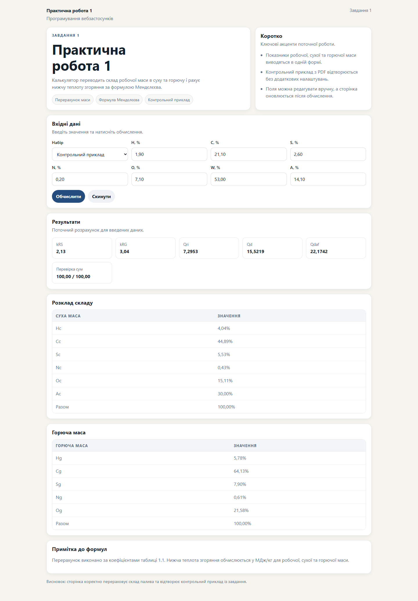

# Звіт до практичної роботи 1

## Тема

Розробка вебзастосунку для перерахунку елементного складу палива та визначення нижчої теплоти згоряння.

## Вимоги із завдання

- перевести склад робочої маси у суху та горючу масу;
- обчислити коефіцієнти `kRS` і `kRG`;
- визначити `Qri`, `Qd` та `Qdaf`;
- відтворити контрольний приклад із PDF;
- оформити сторінку просто, чисто і зручну для перевірки.

## Програмна реалізація

- застосунок реалізовано мовою Go;
- для HTTP-обробки використано пакет `net/http`;
- шаблон сторінки побудовано на `html/template`;
- вихідні дані контрольного прикладу та варіантів збережено у структурі `map`;
- усі формули виконуються на сервері, тому сторінка працює без клієнтського JavaScript;
- результат подається у вигляді метрик і таблиць для сухої та горючої маси.

## Результат роботи

Під час виконання роботи створено вебзастосунок, який приймає склад палива, виконує потрібні перерахунки та одразу відображає обчислені значення у вебінтерфейсі. Контрольний приклад із завдання відтворюється у готовому пресеті, тому результат зручно звіряти з PDF.

## Висновок

У результаті виконання практичної роботи створено простий серверний вебзастосунок на Go, який відповідає вимогам завдання та коректно виконує розрахунки складу палива і теплоти згоряння. Реалізація є зрозумілою, легко перевіряється і підходить для демонстрації в межах дисципліни «Програмування вебзастосунків».

